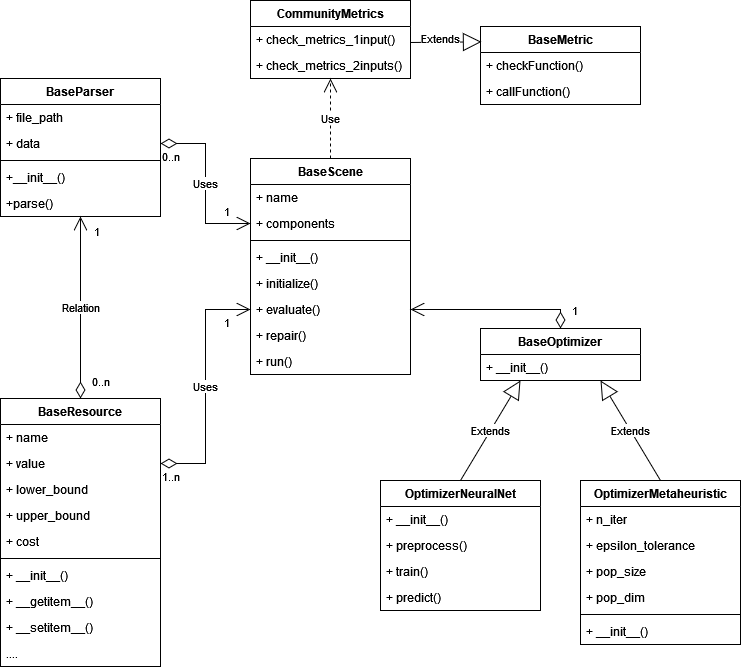

PyECOM is composed by several key components:

- **Algorithms**: Methods to build computational models that simulate and/or forecast attributes of an Energy Community.
- **Markets**: Provide the possibility of interactions between participants of an Energy Community.
- **Metrics**: Performance evaluation of the Energy Community and/or algorithms.
- **Parsers**: Data parsers from different sources.
- **Resources**: Data structures to store information about the Energy Community.
- **Scenes**: Scenarios that make use of available code in this library to simulate functioning of an Energy Community.
- **Utils**: Auxiliary methods to support the functioning of the library.

The following diagram shows the main components of PyECOM and their relationships:

